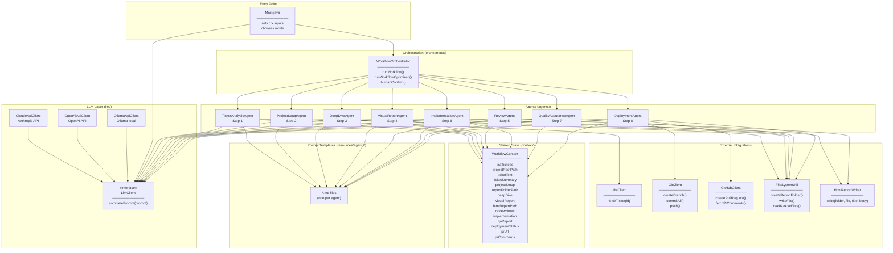
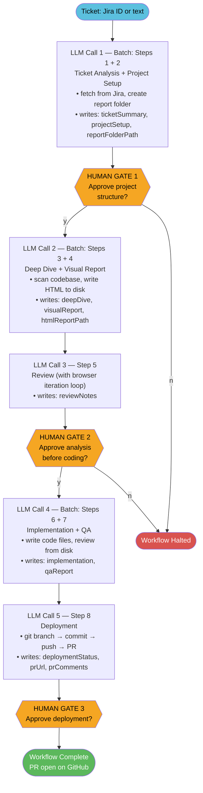
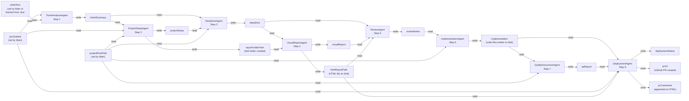
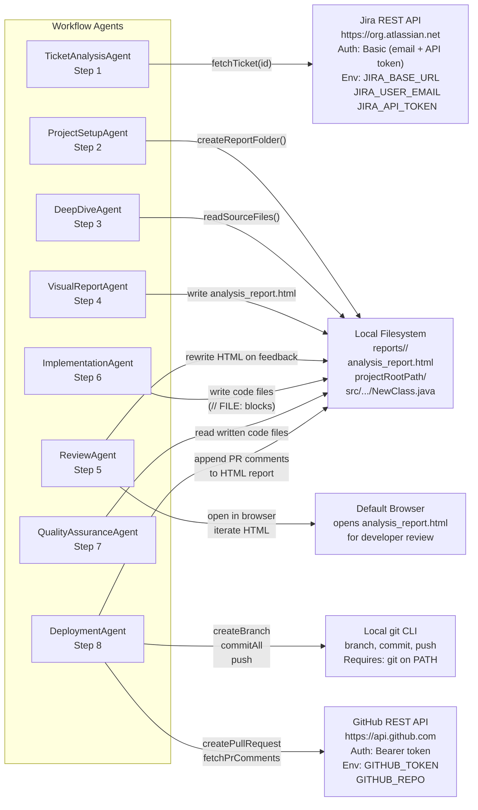
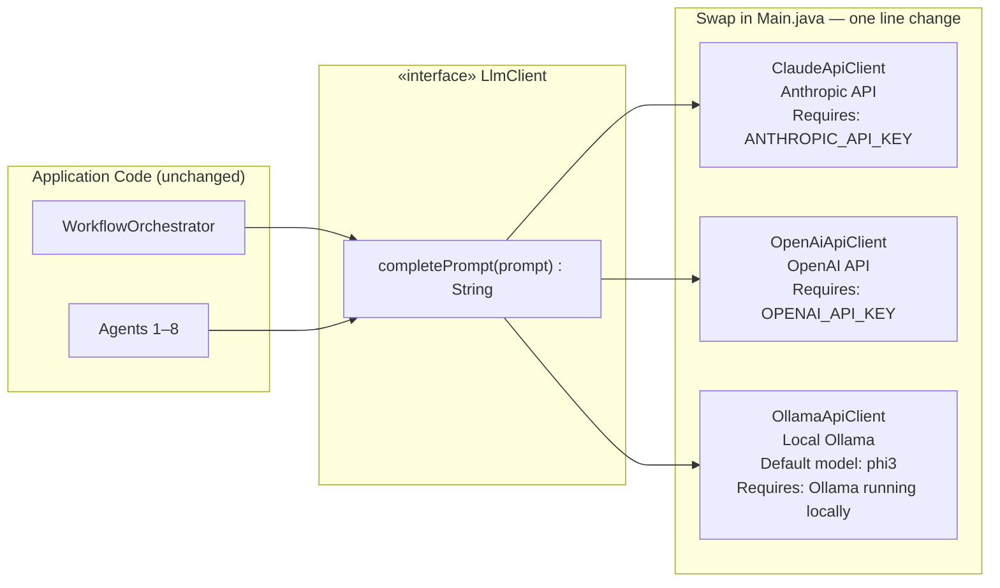
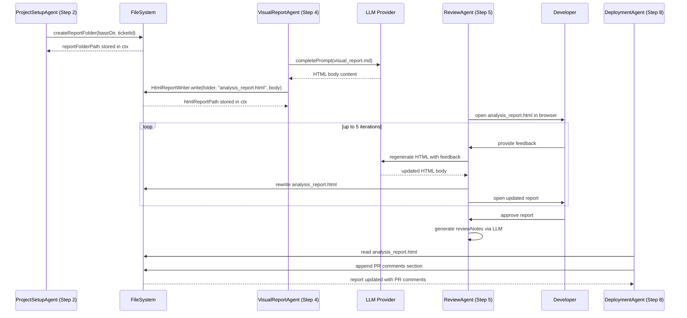
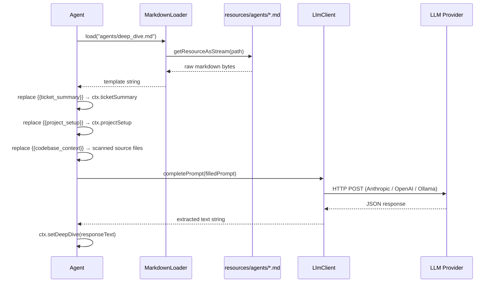

# aidevworkflow — Architecture Diagrams

---

## 1. Project Structure

```
aidevworkflow/
├── pom.xml
└── src/
    ├── main/
    │   ├── java/com/javamsdt/aidevworkflow/
    │   │   ├── Main.java                          ← entry point
    │   │   ├── agents/                            ← 8 stateless agent classes
    │   │   │   ├── TicketAnalysisAgent.java       ← Step 1: fetch from Jira or text
    │   │   │   ├── ProjectSetupAgent.java         ← Step 2: plan + create report folder
    │   │   │   ├── DeepDiveAgent.java             ← Step 3: analyse + scan codebase
    │   │   │   ├── VisualReportAgent.java         ← Step 4: write HTML report to disk
    │   │   │   ├── ReviewAgent.java               ← Step 5: open browser, iterate report
    │   │   │   ├── ImplementationAgent.java       ← Step 6: write code files to disk
    │   │   │   ├── QualityAssuranceAgent.java     ← Step 7: review written code files
    │   │   │   └── DeploymentAgent.java           ← Step 8: commit, push, create PR
    │   │   ├── context/
    │   │   │   └── WorkflowContext.java           ← shared pipeline state (POJO)
    │   │   ├── github/
    │   │   │   ├── GitClient.java                 ← branch, commit, push via git CLI
    │   │   │   └── GitHubClient.java              ← create PR, fetch PR comments
    │   │   ├── jira/
    │   │   │   ├── JiraClient.java                ← fetch ticket via Jira REST API
    │   │   │   └── JiraTicket.java                ← structured ticket record
    │   │   ├── llm/
    │   │   │   ├── LlmClient.java                 ← pluggable interface
    │   │   │   ├── ClaudeApiClient.java           ← Anthropic (ANTHROPIC_API_KEY)
    │   │   │   ├── OpenAiApiClient.java           ← OpenAI   (OPENAI_API_KEY)
    │   │   │   └── OllamaApiClient.java           ← Local    (OLLAMA_BASE_URL)
    │   │   ├── orchestrator/
    │   │   │   └── WorkflowOrchestrator.java      ← coordinates all 8 agents
    │   │   └── util/
    │   │       ├── FileSystemUtil.java            ← folder creation, file read/write, codebase scan
    │   │       ├── HtmlReportWriter.java          ← wraps HTML body in page shell, writes file
    │   │       └── MarkdownLoader.java            ← loads .md prompt templates from classpath
    │   └── resources/
    │       └── agents/                            ← one .md prompt per agent
    │           ├── ticket_analysis.md
    │           ├── project_setup.md
    │           ├── deep_dive.md
    │           ├── visual_report.md
    │           ├── review.md
    │           ├── implementation.md
    │           ├── quality_assurance.md
    │           └── deployment.md
    └── test/
        └── java/com/javamsdt/aidevworkflow/
            ├── agents/TicketAnalysisAgentTest.java
            ├── llm/ClaudeApiClientTest.java
            ├── orchestrator/WorkflowOrchestratorTest.java
            └── util/MarkdownLoaderTest.java
```

---

## 2. Component Diagram



---

## 3. Agent Workflow — Full Modular Mode (8 LLM calls)

```mermaid
flowchart TD
    START([Ticket: Jira ID or text])

    S1["Step 1 — Ticket Analysis\nTicketAnalysisAgent\n• fetch ticket from Jira (if jiraTicketId set)\n• writes: ticketSummary"]
    S2["Step 2 — Project Setup\nProjectSetupAgent\n• create report folder on disk\n• writes: projectSetup, reportFolderPath"]
    G1{{"HUMAN GATE 1\nApprove project\nstructure?"}}
    S3["Step 3 — Deep Dive\nDeepDiveAgent\n• scan codebase source files\n• writes: deepDive (with gap analysis)"]
    S4["Step 4 — Visual Report\nVisualReportAgent\n• LLM generates HTML body\n• write analysis_report.html to disk\n• writes: visualReport, htmlReportPath"]
    S5["Step 5 — Review\nReviewAgent\n• open HTML report in browser\n• iterate (up to 5×) on developer feedback\n• writes: reviewNotes"]
    G2{{"HUMAN GATE 2\nApprove analysis\nbefore coding?"}}
    S6["Step 6 — Implementation\nImplementationAgent\n• LLM generates annotated code blocks\n• parse // FILE: blocks, write files to disk\n• writes: implementation"]
    S7["Step 7 — Quality Assurance\nQualityAssuranceAgent\n• read written code files from disk\n• writes: qaReport"]
    S8["Step 8 — Deployment\nDeploymentAgent\n• LLM generates deployment plan\n• git branch → commit → push → GitHub PR\n• fetch PR comments → update HTML report\n• writes: deploymentStatus, prUrl, prComments"]
    G3{{"HUMAN GATE 3\nApprove deployment?"}}
    END([Workflow Complete\nPR open on GitHub])
    HALT([Workflow Halted])

    START --> S1 --> S2 --> G1
    G1 -- "y (approved)" --> S3
    G1 -- "n (rejected)" --> HALT
    S3 --> S4 --> S5 --> G2
    G2 -- "y (approved)" --> S6
    G2 -- "n (rejected)" --> HALT
    S6 --> S7 --> S8 --> G3
    G3 --> END

    style G1 fill:#f5a623,color:#000
    style G2 fill:#f5a623,color:#000
    style G3 fill:#f5a623,color:#000
    style HALT fill:#d9534f,color:#fff
    style END fill:#5cb85c,color:#fff
    style START fill:#5bc0de,color:#000
```



---

## 4. Agent Workflow — Optimized Mode (5 LLM calls)



---

## 5. WorkflowContext Data Flow

Each agent reads specific fields and writes exactly one or two new fields. The diagram shows the full blackboard data flow.



---

## 6. External Integration Points



---

## 7. LLM Provider Swap



---

## 8. HTML Report Lifecycle

The HTML report is the primary artefact that travels through Steps 2–8, evolving as the workflow progresses.



---

## 9. Prompt Template Resolution

Each agent resolves its prompt at runtime by loading a Markdown template and substituting placeholders with live context values.


