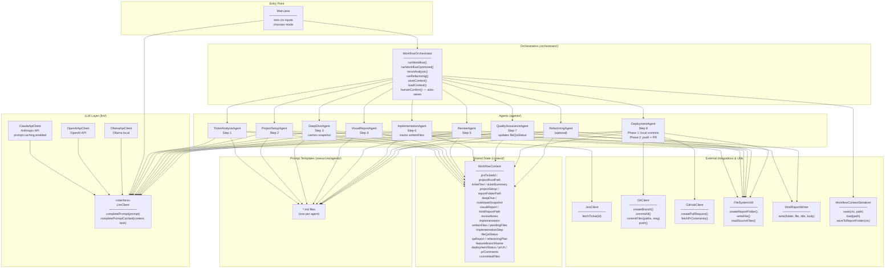
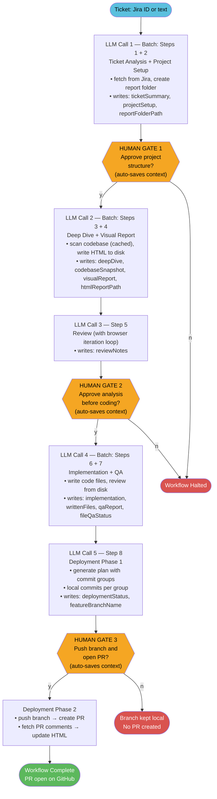
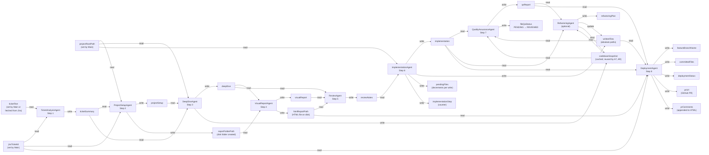
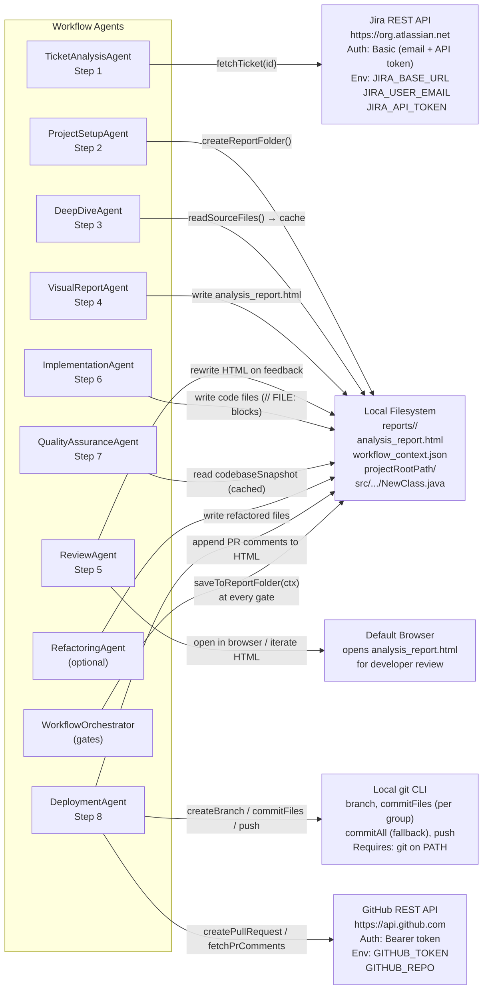
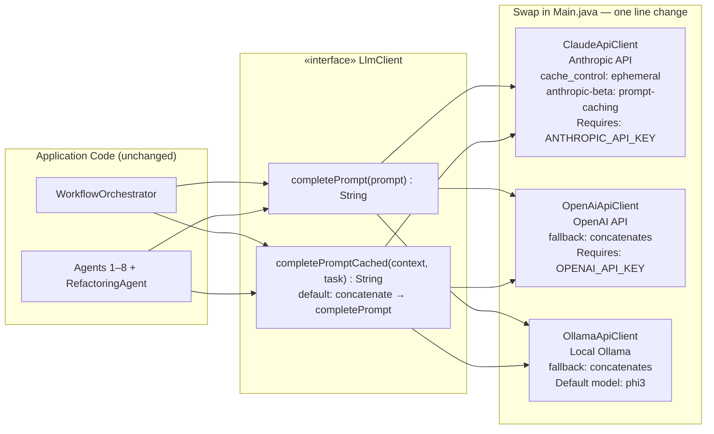
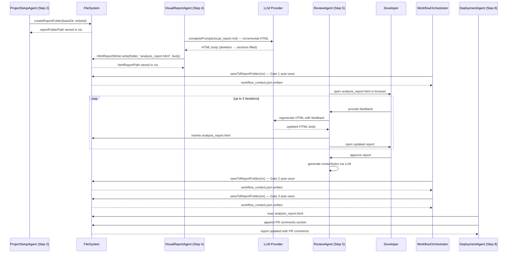
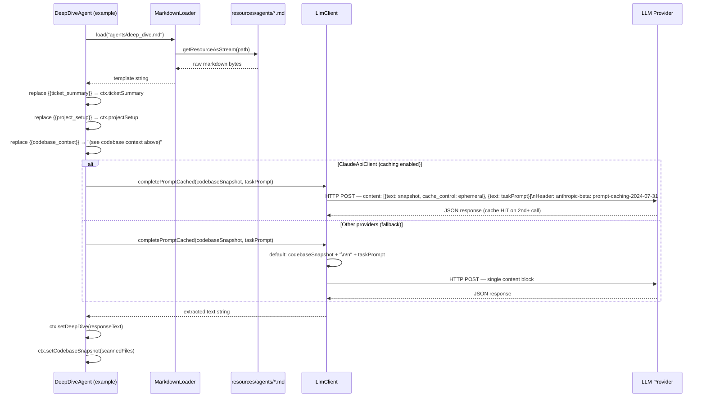
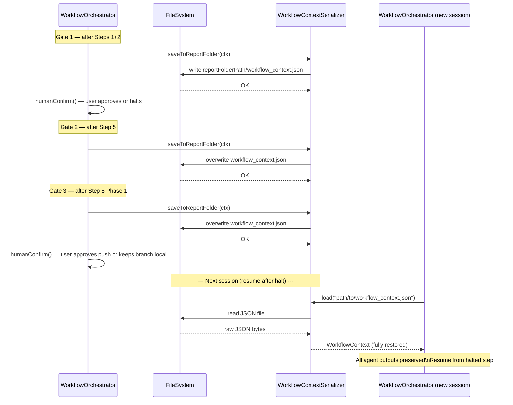
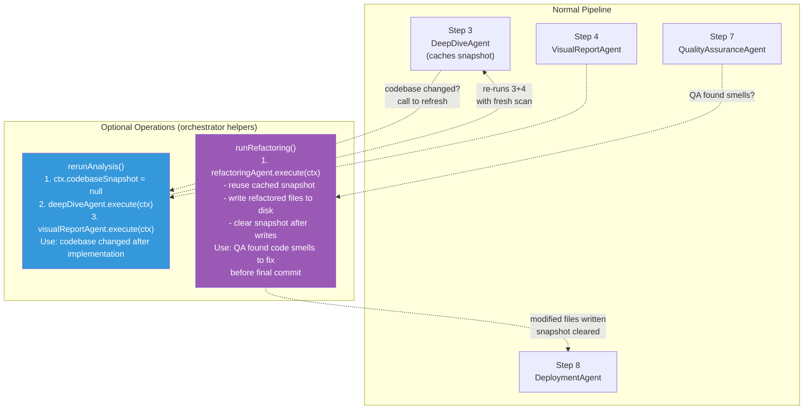

# aidevworkflow — Architecture Diagrams

---

## 1. Project Structure

```
aidevworkflow/
├── pom.xml
└── src/
    ├── main/
    │   ├── java/com/javamsdt/aidevworkflow/
    │   │   ├── Main.java                          ← entry point
    │   │   ├── agents/                            ← stateless agent classes
    │   │   │   ├── TicketAnalysisAgent.java       ← Step 1: fetch from Jira or text
    │   │   │   ├── ProjectSetupAgent.java         ← Step 2: plan + create report folder
    │   │   │   ├── DeepDiveAgent.java             ← Step 3: analyse + scan codebase (cached)
    │   │   │   ├── VisualReportAgent.java         ← Step 4: write HTML report to disk
    │   │   │   ├── ReviewAgent.java               ← Step 5: open browser, iterate report
    │   │   │   ├── ImplementationAgent.java       ← Step 6: write code files, track progress
    │   │   │   ├── QualityAssuranceAgent.java     ← Step 7: review code, update fileQaStatus
    │   │   │   ├── DeploymentAgent.java           ← Step 8: local commits → (Gate 3) → push → PR
    │   │   │   └── RefactoringAgent.java          ← Optional: refactor between QA and Deployment
    │   │   ├── context/
    │   │   │   └── WorkflowContext.java           ← shared pipeline state (POJO, JSON-serializable)
    │   │   ├── github/
    │   │   │   ├── GitClient.java                 ← branch, commitAll, commitFiles, push via git CLI
    │   │   │   └── GitHubClient.java              ← create PR, fetch PR comments
    │   │   ├── jira/
    │   │   │   ├── JiraClient.java                ← fetch ticket via Jira REST API
    │   │   │   └── JiraTicket.java                ← structured ticket record
    │   │   ├── llm/
    │   │   │   ├── LlmClient.java                 ← pluggable interface (completePrompt + completePromptCached)
    │   │   │   ├── ClaudeApiClient.java           ← Anthropic (prompt caching enabled)
    │   │   │   ├── OpenAiApiClient.java           ← OpenAI
    │   │   │   └── OllamaApiClient.java           ← Local (OLLAMA_BASE_URL)
    │   │   ├── orchestrator/
    │   │   │   └── WorkflowOrchestrator.java      ← coordinates all agents; rerunAnalysis, runRefactoring, saveContext, loadContext
    │   │   └── util/
    │   │       ├── FileSystemUtil.java            ← folder creation, file read/write, codebase scan
    │   │       ├── HtmlReportWriter.java          ← wraps HTML body in page shell, writes file
    │   │       ├── MarkdownLoader.java            ← loads .md prompt templates from classpath
    │   │       └── WorkflowContextSerializer.java ← Jackson JSON save/load for session persistence
    │   └── resources/
    │       └── agents/                            ← one .md prompt per agent
    │           ├── ticket_analysis.md
    │           ├── project_setup.md
    │           ├── deep_dive.md
    │           ├── visual_report.md               ← incremental HTML building
    │           ├── review.md
    │           ├── implementation.md              ← Javadoc generation
    │           ├── quality_assurance.md           ← JUnit 5 test generation
    │           ├── deployment.md                  ← conventional commit groups
    │           └── refactoring.md                 ← optional refactoring step
    └── test/
        └── java/com/javamsdt/aidevworkflow/
            ├── agents/TicketAnalysisAgentTest.java
            ├── llm/ClaudeApiClientTest.java
            ├── orchestrator/WorkflowOrchestratorTest.java
            └── util/MarkdownLoaderTest.java
```

---

## 2. Component Diagram



---

## 3. Agent Workflow — Full Modular Mode (8 LLM calls)

```mermaid
flowchart TD
    START([Ticket: Jira ID or text])

    S1["Step 1 — Ticket Analysis\nTicketAnalysisAgent\n• fetch ticket from Jira (if jiraTicketId set)\n• writes: ticketSummary"]
    S2["Step 2 — Project Setup\nProjectSetupAgent\n• create report folder on disk\n• writes: projectSetup, reportFolderPath"]
    G1{{"HUMAN GATE 1\nApprove project\nstructure?\n(auto-saves context)"}}
    S3["Step 3 — Deep Dive\nDeepDiveAgent\n• scan codebase → cache in codebaseSnapshot\n• writes: deepDive (with gap analysis)"]
    S4["Step 4 — Visual Report\nVisualReportAgent\n• LLM generates HTML body (incremental)\n• write analysis_report.html to disk\n• writes: visualReport, htmlReportPath"]
    S5["Step 5 — Review\nReviewAgent\n• open HTML report in browser\n• iterate (up to 5×) on developer feedback\n• writes: reviewNotes"]
    G2{{"HUMAN GATE 2\nApprove analysis\nbefore coding?\n(auto-saves context)"}}
    S6["Step 6 — Implementation\nImplementationAgent\n• LLM generates annotated code blocks\n• parse // FILE: blocks, write files to disk\n• writes: implementation, writtenFiles, pendingFiles"]
    S7["Step 7 — Quality Assurance\nQualityAssuranceAgent\n• reuse cached codebaseSnapshot\n• writes: qaReport, fileQaStatus (REVIEWED)"]
    SREF["Optional — Refactoring\nRefactoringAgent\n• review QA findings + codebase\n• write refactored files to disk\n• writes: refactoringPlan; clears snapshot"]
    S8["Step 8 — Deployment\nDeploymentAgent Phase 1\n• LLM generates plan with commit groups\n• git branch → per-group local commits\n• writes: deploymentStatus, featureBranchName, committedFiles"]
    G3{{"HUMAN GATE 3\nPush branch and\nopen PR?\n(auto-saves context)"}}
    S8B["DeploymentAgent Phase 2\n• push featureBranch to origin\n• create GitHub PR → ctx.prUrl\n• fetch PR comments → update HTML report"]
    END([Workflow Complete\nPR open on GitHub])
    HALT([Workflow Halted])
    NOPR([Branch kept local\nNo PR created])

    START --> S1 --> S2 --> G1
    G1 -- "y (approved)" --> S3
    G1 -- "n (rejected)" --> HALT
    S3 --> S4 --> S5 --> G2
    G2 -- "y (approved)" --> S6
    G2 -- "n (rejected)" --> HALT
    S6 --> S7
    S7 -.->|optional| SREF
    SREF --> S8
    S7 --> S8
    S8 --> G3
    G3 -- "y (approved)" --> S8B --> END
    G3 -- "n (rejected)" --> NOPR

    style G1 fill:#f5a623,color:#000
    style G2 fill:#f5a623,color:#000
    style G3 fill:#f5a623,color:#000
    style HALT fill:#d9534f,color:#fff
    style NOPR fill:#d9534f,color:#fff
    style END fill:#5cb85c,color:#fff
    style START fill:#5bc0de,color:#000
    style SREF fill:#9b59b6,color:#fff
```



---

## 4. Agent Workflow — Optimized Mode (5 LLM calls)



---

## 5. WorkflowContext Data Flow

Each agent reads specific fields and writes exactly one or two new fields. The diagram shows the full blackboard data
flow including new fields added in the implementation.



---

## 6. External Integration Points



---

## 7. LLM Provider Swap



---

## 8. HTML Report Lifecycle

The HTML report is the primary artefact that travels through Steps 2–8, evolving as the workflow progresses.



---

## 9. Prompt Template Resolution

Each agent resolves its prompt at runtime by loading a Markdown template and substituting placeholders with live context
values. Agents that use the codebase snapshot send it as a separate cached block.



---

## 10. Context Persistence & Session Resume

The `WorkflowContextSerializer` saves the full pipeline state to JSON at every human gate.
An interrupted session can be resumed without re-running completed steps.



---

## 11. Optional Steps: rerunAnalysis & runRefactoring

Two optional operations can be triggered at any point after their prerequisite steps complete.


